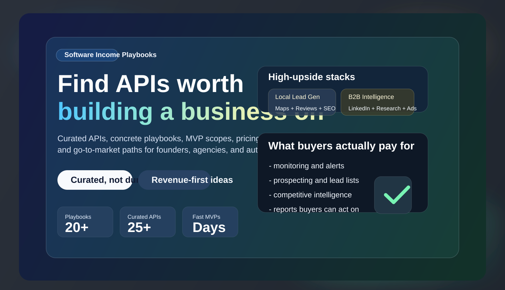

  

# Software Income Playbooks

**Curated APIs + concrete software ideas + monetization-first playbooks**

Find practical ways to turn strong APIs into products, automations, dashboards, lead-gen systems, agency offers, and premium research tools.

[Browse Playbooks](./playbooks/README.md) | [Browse APIs](./apis/README.md) | [Browse Categories](./categories/README.md) | [Use Templates](./templates/README.md)

## Star This Repo

If this repo gives you a build idea, saves you research time, or helps you spot a better API opportunity, give it a star.

That makes it easier for more builders to find it, and it gives the repo social proof as the playbook library grows.

## Why This Repo Exists

Most API collections are giant dumps.

They tell you **what exists**, but not:

- what to build
- who will pay for it
- what the MVP should be
- how quickly you can launch
- how to turn an API into recurring revenue

This repo is built to answer those questions fast.

## What You Get

| Layer | What it gives you |
|---|---|
| [Playbooks](./playbooks/README.md) | Step-by-step business ideas with customer, pain point, MVP, pricing, and go-to-market guidance |
| [Curated APIs](./apis/README.md) | High-signal APIs worth building around, with strengths, caveats, and product angles |
| [Categories](./categories/README.md) | Opportunity maps by market like lead gen, recruiting, local business, SEO, real estate, hospitality, and more |
| [Templates](./templates/README.md) | Reusable formats for adding new ideas, API profiles, MVP specs, and GTM plans |
| [Resources](./resources/README.md) | Practical docs on choosing APIs, validating ideas, and pricing micro-SaaS or productized services |

## Why Builders Keep Coming Back

- fast-to-understand business ideas instead of vague startup brainstorming
- API picks filtered for commercial usefulness, not novelty
- clear paths from manual service to recurring software revenue
- playbooks that help you decide what is worth building before you overbuild it

## This Is For

- founders who want a faster path to a monetizable MVP
- indie hackers who want narrower, more believable ideas
- agencies turning repeatable service work into software
- automation builders packaging internal tools into offers
- developers who want more commercial clarity from API discovery

## Start Here

### If You Want Fastest-to-Cash Ideas

- [Outbound Account List Builder](./playbooks/outbound-account-list-builder.md)
- [Review Recovery Engine](./playbooks/review-recovery-engine.md)
- [SEO Opportunity Briefing](./playbooks/seo-opportunity-briefing.md)
- [Travel Price Watch Concierge](./playbooks/travel-price-watch-concierge.md)
- [Account Intel Copilot](./playbooks/account-intel-copilot.md)

### If You Want High-Value B2B Products

- [LinkedIn Ad Intelligence Vault](./playbooks/linkedin-ad-intelligence-vault.md)
- [Supplier Risk Watchtower](./playbooks/supplier-risk-watchtower.md)
- [Grant And Compliance Radar](./playbooks/grant-and-compliance-radar.md)
- [Founder Acquisition Radar](./playbooks/founder-acquisition-radar.md)
- [Geopolitical Risk Brief](./playbooks/geopolitical-risk-brief.md)

### If You Want Service-First Offers That Can Become SaaS

- [Local Rank and Review Monitor](./playbooks/local-rank-and-review-monitor.md)
- [Hospitality Reputation Monitor](./playbooks/hospitality-reputation-monitor.md)
- [Recruiting Market Radar](./playbooks/recruiting-market-radar.md)
- [Company Research Briefing Service](./playbooks/company-research-briefing-service.md)
- [LinkedIn Content Benchmark](./playbooks/linkedin-content-benchmark.md)

## Featured API Stacks

| Opportunity | Stack | Why it can make money |
|---|---|---|
| Local lead gen + reputation | [AI Google Maps Extractor](./apis/ai-google-maps-extractor.md) + [Google Maps AI Reviews Analyzer](./apis/google-maps-ai-reviews-analyzer.md) + [Semrush Scraper](./apis/semrush-scraper.md) | Agencies and local operators pay for lead flow, review intelligence, and competitor visibility |
| B2B account intelligence | [AI Company Researcher](./apis/ai-company-researcher.md) + [LinkedIn Profile Scraper](./apis/linkedin-profile-scraper.md) + [Similarweb Scraper](./apis/similarweb-scraper.md) | Easy to productize into pre-call briefs, prospect research, and strategic outbound prep |
| B2B marketing research | [LinkedIn Ads Scraper](./apis/linkedin-ads-scraper.md) + [LinkedIn Post Scraper](./apis/linkedin-post-scraper.md) | Clear demand from agencies and in-house teams who need competitor creative and positioning intelligence |
| SEO and content opportunity | [Keyword Opportunity Agent](./apis/keyword-opportunity-agent.md) + [Semrush Scraper](./apis/semrush-scraper.md) + [Youtube Transcript Scraper](./apis/youtube-transcript-scraper.md) | Lets you sell briefs, planning, monitoring, and content systems quickly |
| Hospitality intelligence | [Tripadvisor Reviews](./apis/tripadvisor-reviews.md) + [Google Maps AI Reviews Analyzer](./apis/google-maps-ai-reviews-analyzer.md) | Hotels and restaurants pay for review intelligence when the output leads to operational fixes or better positioning |
| Supply chain and risk | [Supply Chain Intel](./apis/supply-chain-intel.md) + [World News Intelligence](./apis/world-news-intelligence.md) | Premium niche, expensive pain, strong fit for executive briefings and alerts |

## Best APIs To Build Around

These are strong not because they are flashy, but because they can power things people will actually buy.

| API | Best for | Best business model |
|---|---|---|
| [AI Google Maps Extractor](./apis/ai-google-maps-extractor.md) | Local business data, lead gen, geo intelligence | Agency offer / SaaS |
| [Leads Finder](./apis/leads-finder.md) | Prospecting and outbound systems | Productized service / SaaS |
| [LinkedIn Profile Scraper](./apis/linkedin-profile-scraper.md) | Recruiting and B2B account research | SaaS / internal tool |
| [Linkedin Jobs Scraper](./apis/linkedin-jobs-scraper.md) | Hiring analytics and market signals | SaaS / data product |
| [LinkedIn Ads Scraper](./apis/linkedin-ads-scraper.md) | Competitor ad research | Premium SaaS / agency service |
| [Google Maps AI Reviews Analyzer](./apis/google-maps-ai-reviews-analyzer.md) | Review intelligence and reputation strategy | Agency service / SaaS |
| [Amazon Seller Data Extractor](./apis/amazon-seller-data-extractor.md) | Seller intelligence and marketplace research | SaaS / analyst tool |
| [Keyword Opportunity Agent](./apis/keyword-opportunity-agent.md) | SEO briefs and content strategy | Productized service / SaaS |
| [AI Company Researcher](./apis/ai-company-researcher.md) | Company briefings and sales prep | Productized service / internal tool |
| [Supply Chain Intel](./apis/supply-chain-intel.md) | Procurement and disruption monitoring | Premium intelligence product |

## Fastest Paths To Revenue

If the goal is to start making money quickly, these are the easiest patterns to sell:

1. **Audit products**
   Turn API output into one-time reports buyers can use immediately.
2. **Monitoring and alerts**
   Watch specific competitors, reviews, routes, listings, or signals and send updates.
3. **Research workflows**
   Replace repetitive manual research for agencies, sales teams, or operators.
4. **Niche dashboards**
   Only after the workflow is proven and a narrow buyer is paying repeatedly.

## Browse By Category

- [Lead Generation](./categories/lead-generation.md)
- [Recruiting](./categories/recruiting.md)
- [Local Business](./categories/local-business.md)
- [Ecommerce](./categories/ecommerce.md)
- [Social Media](./categories/social-media.md)
- [Real Estate](./categories/real-estate.md)
- [Market Intelligence](./categories/market-intelligence.md)
- [Content Automation](./categories/content-automation.md)
- [SEO And Content](./categories/seo-and-content.md)
- [Hospitality And Travel](./categories/hospitality-and-travel.md)
- [Funding And Risk](./categories/funding-and-risk.md)

## What A Good Playbook Includes

Every playbook is designed to be skim-friendly and decision-friendly:

- title and one-line summary
- customer and pain point
- product idea and MVP features
- best APIs to use
- monetization model and pricing ideas
- build difficulty and time to first version
- go-to-market approach
- risks and caveats
- best fit for SaaS, agency service, automation, internal tool, or info product

## Why The Curation Matters

This repo intentionally avoids turning into a giant dump of thousands of mediocre APIs.

The goal is to help you reach a fast conclusion:

- **this idea is worth testing**
- **this API can support a paid product**
- **this is the fastest MVP**
- **this is how to pitch it**

## Transparency

Some API links in this repo preserve affiliate tracking from the original source material. That does not change the selection standard here: the bar is still whether an API can credibly support a useful business.

## Stargazers

  

## Legacy Source Material

The original cloned mega-list content still exists in [archive/legacy-api-dump](./archive/legacy-api-dump/) for traceability and future mining, but the main experience is now curated.
